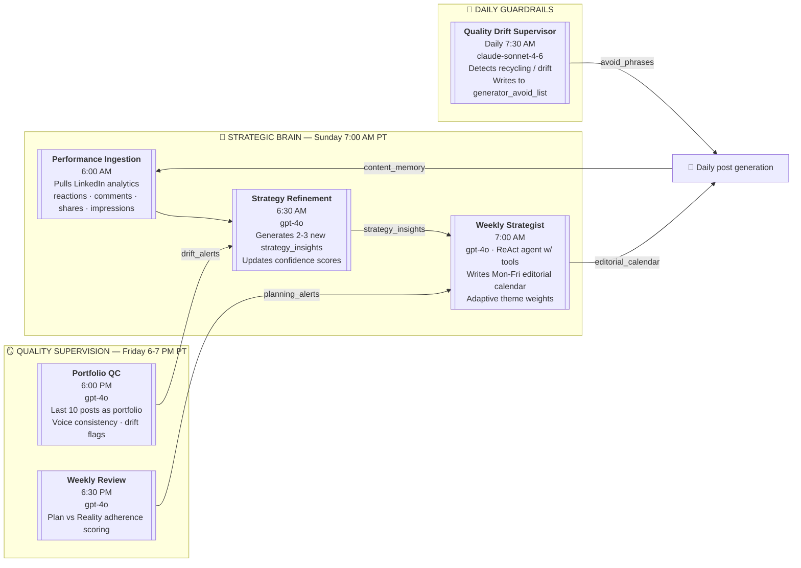

# Jesse A. Eisenbalm — Content Pipeline Architecture

**A multi-agent LLM system that produces scroll-stopping satirical LinkedIn posts.**
Every post a reader sees has been routed through 14+ specialized agents: news curation, editorial strategy, voice/register selection, craft generation, adversarial validation, and post-publication learning.

---

## High-level pipeline (one post end-to-end)

```mermaid
flowchart TB
    subgraph "🌎 SOURCING LAYER — Multi-tier news ingestion"
        T1["Tier 1 · AI Research<br/>HuggingFace · arXiv · Alignment Forum"]
        T2["Tier 2 · Editorial<br/>NYT · Politico · Atlantic · Semafor · NPR"]
        T3["Tier 3 · Cultural Pulse<br/>Brave Search API · Reddit × 7 subs · Google Trends"]
        T4["Tier 4 · Policy<br/>CSET · AI Now Institute"]
    end

    subgraph "🪣 DIVERSITY LAYER"
        STRAT[["<b>Diversity Stratifier</b><br/>Phase M·N<br/>• 6 canonical buckets<br/>• Non-US pre-filter (14 regex)<br/>• MMR rerank<br/>• In-batch sibling dedup"]]
    end

    subgraph "🎰 BATCH COORDINATION"
        BC[["<b>BatchContext</b><br/>Phase H·N<br/>• Pre-allocates slot per post<br/>  register × temp × frame × comedy_move<br/>• Register-aware bias toward deficit personas<br/>• Embedding dedup (OpenAI text-embed-3-small)"]]
    end

    subgraph "🤖 AGENT CHAIN — Each post"
        CURATOR[["<b>News Curator</b><br/>gpt-4o-mini<br/>• Picks 1 trend from balanced slate<br/>• Five Questions rubric<br/>• US-focus hard-reject<br/>• Fact-checks concrete_details<br/>• Entity-overlap self-correction"]]

        ARCHITECT[["<b>Angle Architect</b><br/>gpt-4o<br/>• Emits 15-field blueprint JSON<br/>• Register (5 voices · slot-honored)<br/>• Comedy move (Phase J · 4 techniques)<br/>• Emotional contact (4-field specificity)<br/>• Contact-beat frame rotation<br/>• Persona-deficit forcing"]]

        GEN[["<b>Content Generator</b><br/>claude-sonnet-4-6 · temp 0.9<br/>• Candidate-3-pick-1 (verbalized sampling)<br/>• Canonical register examples (few-shot)<br/>• 25+ hard-rule regex bans<br/>• Truncation recovery<br/>• Content cleanup"]]

        subgraph "⚖️ VALIDATORS — 2-of-3 consensus required"
            SARAH[["<b>Sarah Chen</b><br/>claude-sonnet-4-6<br/>Strategic — 4 Qs<br/>brand-stamp · POV · essay drift · anchor"]]
            MARCUS[["<b>Marcus Williams</b><br/>gpt-4o<br/>Craft — 6 Qs<br/>weakest sentence · metaphors · voice drift<br/>template crutch · grammar · emotional contact"]]
            JORDAN[["<b>Jordan Park</b><br/>claude-haiku-4.5<br/>Audience — 5 Qs<br/>opener · STEPPS · voice · scroll test"]]
        end

        REV[["<b>Revision Generator</b><br/>Iterative repair<br/>• Aggregates validator feedback<br/>• Up to 3 revision attempts<br/>• Returns if &lt;2/3 approvals → reject"]]

        GATE{{"FINAL HARD-RULE GATE<br/>Phase N<br/>Any remaining regex violation → reject"}}
    end

    subgraph "📤 OUTPUT"
        IMG[["<b>Image Generator</b><br/>Google Imagen 4<br/>• Brand-aware prompts<br/>• Graceful skip on SDK drift"]]
        POS[["<b>Position Extractor</b><br/>gpt-4o-mini<br/>Pulls named claims for learning"]]
        QUEUE[("<b>Post Queue</b><br/>SQLite<br/>• Validation scores<br/>• Ready for scheduler"))
        POSTER[["<b>LinkedIn Poster</b><br/>• Publishes post<br/>• Auto-CTA comment<br/>• Records URN for analytics"]]
    end

    T1 --> STRAT
    T2 --> STRAT
    T3 --> STRAT
    T4 --> STRAT
    STRAT --> CURATOR
    BC -.->|slot:<br/>register+temp+<br/>frame+comedy| ARCHITECT
    BC -.->|topic<br/>dedup| STRAT
    CURATOR --> ARCHITECT
    ARCHITECT --> GEN
    GEN --> SARAH
    GEN --> MARCUS
    GEN --> JORDAN
    SARAH --> REV
    MARCUS --> REV
    JORDAN --> REV
    REV --> GATE
    GATE -->|pass| IMG
    GATE -->|pass| POS
    GATE -->|fail| X[❌ Rejected]
    IMG --> QUEUE
    POS --> QUEUE
    QUEUE --> POSTER
```

---

## The Think/Learn Layer (runs on schedule, not per-post)



---

## How the agents communicate (exact data handoffs)

Each arrow in the pipeline above carries a specific, typed payload. Agents do not share memory — every handoff is an explicit object. This is what makes the system debuggable and modular.

### Sequence diagram: one post, agent-to-agent

```mermaid
sequenceDiagram
    autonumber
    participant Orch as Orchestrator
    participant BC as BatchContext
    participant TS as TrendService
    participant Strat as Stratifier
    participant Cur as NewsCurator
    participant Arch as AngleArchitect
    participant Gen as Generator
    participant Val as Validators (×3)
    participant Rev as RevisionGen
    participant Mem as Memory

    Orch->>BC: for_batch(batch_id, num_posts, recent_registers)
    BC-->>Orch: slots[]: {register, temp, frame, comedy_move} × N

    loop Each post
        Orch->>TS: get_candidate_trends(count=8)
        TS->>Strat: raw_candidates[]
        Strat-->>TS: balanced slate[] (6 buckets, MMR-ranked, non-US filtered)
        TS-->>Orch: 8 TrendingNews candidates

        Orch->>Cur: execute(post_id, preferred_theme)
        Cur-->>Orch: trend.structured_angle = {observation, take, concrete_details, tension}

        Orch->>BC: is_topic_duplicate(trend_text)?
        BC-->>Orch: (is_dup, similarity)
        Note over Orch: reroll up to 3× if duplicate

        Orch->>Arch: execute(trend, recent_registers, slot, recent_comedy_moves, ...)
        Arch-->>Orch: blueprint = {register, opinion, ski_jump, comedy_move,<br/>emotional_contact{4 fields}, contact_frame, ...}
        Note over Arch: slot-forced register honored;<br/>deficit-persona override if needed

        Orch->>Gen: execute(strategy, blueprint, memory_context, gold_examples)
        Gen->>Gen: generate 3 candidates (verbalized sampling)
        Gen->>Gen: _score_emotional_contact × 3 → pick winner
        Gen->>Gen: hard-rule regex check → retry if violations
        Gen->>Gen: FINAL hard-rule gate → reject if still violating
        Gen-->>Orch: LinkedInPost(content, hook, cultural_reference, ...)

        par Parallel validation
            Orch->>Val: Sarah.execute(post)
            Val-->>Orch: ValidationScore(Sarah, score, approved, feedback)
        and
            Orch->>Val: Marcus.execute(post)
            Val-->>Orch: ValidationScore(Marcus, score, approved, feedback)
        and
            Orch->>Val: Jordan.execute(post)
            Val-->>Orch: ValidationScore(Jordan, score, approved, feedback)
        end

        alt approval_count < 2
            Orch->>Rev: execute(post, aggregated_feedback)
            Rev-->>Orch: revised post (up to 3 attempts)
            Note over Orch: if still <2/3 → REJECT
        end

        alt was_approved
            Orch->>BC: commit(headline, body, bucket)
            Note over BC: embedding dedup<br/>for next sibling
            Orch->>TS: add_sibling_bucket(bucket)
            Orch->>Mem: remember_post(post_id, content, blueprint,<br/>validation_scores, theme, register, ...)
            Note over Mem: content_memory DB row<br/>for rotation + learning
        end
    end
```

### The exact messages (data contracts)

Every edge in the flow carries one of these structured payloads:

| # | From → To | Message shape | Fields |
|---|---|---|---|
| 1 | **Orchestrator → BatchContext** | `for_batch()` call | `batch_id, num_posts, ai_client, recent_registers[]` |
| 2 | **BatchContext → Orchestrator** | `slots[]` | Per post: `{register, emotional_temperature, frame, comedy_move}` |
| 3 | **TrendService → Stratifier** | `List[TrendingNews]` | `{headline, summary, category, fingerprint, cluster_score, viral_indicators, theme, tier}` |
| 4 | **Stratifier → TrendService** | Filtered `List[TrendingNews]` | Same shape, ≤8 items, bucket-balanced, non-US filtered |
| 5 | **Orchestrator → NewsCurator** | `execute()` kwargs | `{post_id, preferred_theme}` |
| 6 | **NewsCurator → Orchestrator** | Single `TrendingNews` w/ angle | `trend + trend.structured_angle={observation, take, concrete_details[], tension}` |
| 7 | **Orchestrator → BatchContext** | `is_topic_duplicate(text)` | Cosine similarity against committed sibling embeddings |
| 8 | **Orchestrator → Architect** | `execute()` kwargs | `trend_headline, trend_summary, curator_angle, recent_{registers, length_targets, structure_shapes, emotional_temperatures, opening_patterns, contact_beat_frames, comedy_moves}, forced_{register, emotional_temperature, frame, comedy_move}` |
| 9 | **Architect → Orchestrator** | `blueprint` dict | `{register, emotional_temperature, comedy_move, comedy_move_form, opinion:{type,claim,evidence_hint}, ski_jump_setup, ski_jump_punchline, brutal_honesty_beat, anchor_human, contact_beat, emotional_contact:{named_stakeholder, private_scene, photographable_noun, scale_anchor, complete}, stepps_targets[], first_49_chars_hook, length_target, structure_shape, contact_frame, avoid[]}` |
| 10 | **Orchestrator → Generator** | `execute()` kwargs | `{post_number, batch_id, trending_context, requested_pillar, requested_format, avoid_patterns, structured_angle, blueprint}` |
| 11 | **Generator → Generator** (internal × 3) | 3 candidate drafts | Different `temperature` perturbations (±0.08) |
| 12 | **Generator → Orchestrator** | `LinkedInPost` or `None` | `{content, hook, hashtags:[], cultural_reference, creative_reasoning, why_this_works, total_tokens_used}` |
| 13 | **Orchestrator → Validator×3** (parallel) | `post` object | Full LinkedInPost for evaluation |
| 14 | **Validator → Orchestrator** | `ValidationScore` | `{agent_name, score, approved, feedback, criteria_breakdown}` |
| 15 | **Orchestrator → Revision** | `(post, aggregated_feedback)` | Post + merged validator critiques |
| 16 | **Revision → Orchestrator** | Updated `LinkedInPost` | Same shape, revised content |
| 17 | **Orchestrator → BatchContext** | `commit(headline, body, bucket)` | Registers sibling for next iterations |
| 18 | **Orchestrator → TrendService** | `add_sibling_bucket(bucket)` | Stratifier avoids bucket in next call |
| 19 | **Orchestrator → Memory** | `remember_post(...)` | Full post + metadata persisted to SQLite |

### Key design principles of the communication layer

**1. No shared mutable state between agents.** Each agent receives an immutable input and returns a pure output. The orchestrator is the only component that mutates the "world state" (BatchContext, memory, trend_service).

**2. Every agent handoff is observable.** Payloads are either plain dicts or typed dataclasses (`TrendingNews`, `LinkedInPost`, `ValidationScore`) — logged and inspectable. This is why we can debug "why did Jesse pick tech again?" down to the specific bucket distribution in the stratifier.

**3. Validators run in parallel, not sequence.** Sarah/Marcus/Jordan execute simultaneously via `asyncio.gather`. They don't know about each other's verdicts — they judge independently. The orchestrator aggregates their 3 independent ValidationScores to compute approval consensus.

**4. BatchContext is the sibling-awareness channel.** Because LLMs are stateless per call, without BatchContext each of 7 concurrent posts would see no siblings and could pick the same topic/register. BatchContext is the coordination substrate.

**5. Memory is the learning channel.** The Sunday `StrategyRefinement` agent reads `content_memory` — with validator scores, registers, and (if LinkedIn API) engagement data — to distill `strategy_insights` that feed back into next week's `editorial_calendar`. The pipeline adapts over time.

**6. Graceful degradation at every boundary.** If stratifier fails → return raw pool. If architect fails → fallback blueprint. If embeddings fail → lexical dedup. If image gen fails → post without image. No single component failure halts the pipeline.

---

## Model & cost distribution

| Role | Model | Cost tier | Why |
|---|---|---|---|
| Content Generator (main writer) | `claude-sonnet-4-6` | Mid | #1 on EQ-Bench creative writing; strongest voice-hold |
| Sarah Chen validator | `claude-sonnet-4-6` | Mid | Strategic critique under rubric |
| Marcus Williams validator | `gpt-4o` | Mid | Structural/grammar reading |
| Jordan Park validator | `claude-haiku-4.5` | Low | Fast audience signals |
| Angle Architect | `gpt-4o` | Mid | 15-field structured JSON reliability |
| News Curator | `gpt-4o-mini` | Low | Constrained selection task |
| Position Extractor | `gpt-4o-mini` | Low | Named-entity extraction |
| Weekly agents (Strategist/QC/Review/Refinement) | `gpt-4o` | Mid | Editorial reasoning |
| Embeddings (dedup) | `text-embedding-3-small` | Low | Short-text cosine similarity |
| Image generation | Google Imagen 4 | Low | $0.03/image |

**Per-post cost estimate: ~$0.03–0.05 (6 LLM calls + image)** — validators/architect/generator/curator/extractor each run once; generator runs 3× for candidate selection; image optional.

---

## Key architectural decisions (why it's built this way)

### 1. **Diversity is enforced upstream, not downstream**
The stratifier (Phase M) sits between the source pool and the curator. Without it, Brave Search's tech-heavy query pool would crowd out Reddit/RSS cultural content — and the curator would always pick tech. The 6 canonical buckets (`ai_business`, `politics`, `social_viral`, `culture`, `corporate_absurd`, `other`) enforce Techmeme-style round-robin balance.

### 2. **Slot pre-allocation prevents batch monoculture**
`BatchContext` (Phase H) allocates `register × emotional_temperature × frame × comedy_move` to each post BEFORE any agent runs. A batch of 7 posts can't converge on "7 contrarian posts" because the slots forbid it. Phase N added register-aware bias so 1-post batches also respect cross-batch history.

### 3. **Each validator has a specific personality, not a general rubric**
- **Sarah Chen** = strategic/brand (is this on-voice?)
- **Marcus Williams** = craft (is the writing actually good?)
- **Jordan Park** = audience (will it stop a scroll?)

2-of-3 approval required. Disagreements produce richer revision feedback than a single-critic system.

### 4. **Hard-rule regex gate at every stage**
25+ regex patterns accumulated across Phase A-N: banned openers, aphoristic closers, "Jesse-as-AI contrast" engines, brand-stamp patterns, truncation fragments. Every violation triggers a retry; if the retry also fails, the post is **hard-rejected** (Phase N) — it cannot reach the queue.

### 5. **Canonical examples where rules fail**
Phase O added hand-crafted few-shot examples for each register. When the slot forces `register=prophet`, the generator sees an actual prophet post as the target shape — not just an abstract description. This fixed the "prophet/confession/roast never show up" problem that 4 rotation phases couldn't solve.

---

## What makes this different from "GPT writes LinkedIn posts"

1. **News curation is semantic, not keyword** — US-focus filter + non-US heuristic + recognizability check + 5-Questions rubric
2. **Voice diversity is architecturally enforced** — you cannot get 5 contrarian posts in a row; slots forbid it
3. **The "5 Questions" editorial spine** — every post answers one of: THE WHAT, WHAT IF, WHO PROFITS, HOW TO COPE, WHY IT MATTERS
4. **Comedy is a named move, not an instruction** — 4 comedy techniques (genre_pastiche, register_costume, false_parallel_list, anti_climactic_diminishment) rotated per post
5. **Emotional contact is required** — 4 typed fields (named_stakeholder, private_scene, photographable_noun, scale_anchor) guarantee specificity
6. **Learning loop** — Sunday performance ingestion → Strategy Refinement → editorial calendar adapts to engagement data

---

## Pipeline evolution (14 phases, April 2026)

Each phase targeted a specific failure mode observed in queue review:

- **Phase A** — Viral signal scoring (cross-source cluster detection)
- **Phase B** — Entity extraction (for dedup + fact-check)
- **Phase C** — Length + structure rotation (killed "every post is 4 paragraphs")
- **Phase D** — Zero-register forcing (prophet/confession had been missing for 10+ posts)
- **Phase E** — Emotional temperature + anchor_human + "THE BOTH RULE"
- **Phase F** — 4-field emotional_contact (specificity as the emotional vector)
- **Phase G** — Contact-beat frame rotation
- **Phase H** — BatchContext slot pre-allocation + embedding dedup
- **Phase I** — Model migration attempt (rolled back due to API drift)
- **Phase J** — Comedy moves (4 named techniques) + banned-engine regex
- **Phase K** — Truncation recovery + curator fact-check + Imagen SDK defense
- **Phase L** — Register-pick triggers + scroll-stopping opener audit + persona-deficit forcing
- **Phase M** — Diversity stratifier (6 buckets, MMR, Techmeme round-robin)
- **Phase N** — Final hard-rule gate + non-US filter + in-batch sibling dedup + register-aware slot bias
- **Phase O** — Canonical register examples (few-shot prophet/confession/roast)

---

## File map

| Layer | File | Purpose |
|---|---|---|
| Entry | `api/main.py` | FastAPI endpoints, scheduler hooks |
| Orchestrator | `src/services/orchestrator.py` | Per-post pipeline control |
| Batch state | `src/services/batch_context.py` | In-batch slot + dedup |
| Sourcing | `src/infrastructure/trend_service.py` | Multi-tier fetch |
| Sourcing | `src/infrastructure/source_integrations/*` | Reddit / RSS / Brave / etc |
| Diversity | `src/infrastructure/diversity_stratifier.py` | MMR + bucket rotation |
| Viral signals | `src/infrastructure/viral_signals.py` | Entity + cluster scoring |
| Curator | `src/agents/news_curator.py` | Trend pick with US-focus |
| Architect | `src/agents/angle_architect.py` | Blueprint design |
| Generator | `src/agents/content_strategist.py` | Post writing + 3-pick-1 |
| Validators | `src/agents/validators/{sarah_chen,marcus_williams,jordan_park}.py` | Adversarial QC |
| Revision | `src/agents/revision_generator.py` | Feedback-driven repair |
| Learning | `src/agents/{strategy_refinement,weekly_strategist,weekly_review,portfolio_qc,quality_drift}.py` | Scheduled intelligence |
| Memory | `src/infrastructure/memory/agent_memory.py` | SQLite state |
| Output | `src/services/linkedin_poster.py` | Publishing |
